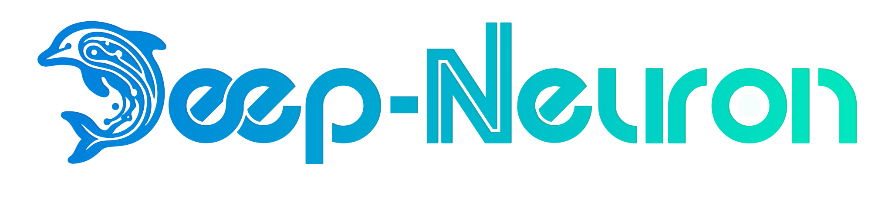

<p><a href="" target="_blank" rel="noopener noreferrer"></a></p>

## Deep Neuron

Description...

## 🚀 Get Started

#### Live instances

- Production: [TBA]() (latest [release (TBA)]())
- Preview: [TBA]() ([branch `main`)](https://github.com/deep-neuron-llc/deep_neuron_website))

#### 🐳 Docker

We use a multi-stage Dockerfile (build → runtime) to keep the final image small and production-only. (docs[https://docs.docker.com/build/building/multi-stage/]())

- To build run with tag deep-neuron -t ```<tag-name>```
```bash
  docker build -t deep-neuron .
```
- To run the container use 
```bash
  docker run --name deep-neuron -p 3000:3000 deep-neuron
```
Here the container is build with name tag using --name ```<name of the conatiner>```. Which makes easy to stop or delete the container with the name. Port 3000 ```-p <host-port>:<container-port>``` to map the port between host and container.

- After stop the container if the contianer is not deleted to run again use
```bash
  docker run -p 3000:3000 deep-neuron
```
- To stop the container 
```bash
  docker stop deep-neuron
```
or ctrl+c which might not stop the cotnainer immedietly as for now ([https://stackoverflow.com/questions/52518477/why-cant-i-always-kill-a-docker-process-with-ctrl-c]). Use ctrl+c 3 times to stop the process for now or docker stop.

- To delete the container
```bash
  docker rm -f deep-neuron
```

- If the --name is not use to stop or delete run 
```bash
  docker ps -a
```
get the container_id or container_name then use the command with the corresponding id or name to stop or delete the container.
## 🖥️ Application stack

- TBA

## 🔨 Development Setup Guide

#### Step 1: Pre-requisites

- Node.js on [Ubuntu](https://www.digitalocean.com/community/tutorials/how-to-install-node-js-on-ubuntu-22-04)/[Windows]([https://nodejs.org/dist/v20.17.0/](https://nodejs.org/en/blog/release/v22.18.0))
  - Preferred to install Node Version Manager (NVM) for [Ubuntu](https://tecadmin.net/how-to-install-nvm-on-ubuntu-22-04/)/[Windows](https://github.com/coreybutler/nvm-windows/releases).
  - Open a terminal and then type `nvm install 22.18.0` to install Node.js 22.18.0
  - Then type `nvm use 22.18.0` to use the Node.js v22.18.0 to install node packages
- Preferred IDE IntelliJ Ultimate [Ubuntu](https://www.golinuxcloud.com/install-maven-ubuntu/)/[Windows](https://www.jetbrains.com/de-de/idea/download/#section=windows)
- Git on [Ubuntu](https://www.digitalocean.com/community/tutorials/how-to-install-git-on-ubuntu-22-04#installing-git-with-default-packages)/ [Windows](https://git-scm.com/downloads)
- (Optional) Github Desktop on [Ubuntu](https://www.linuxcapable.com/how-to-install-github-desktop-on-ubuntu-linux/)/[Windows](https://desktop.github.com/)

#### Step 2: Installation Guide

- Clone the repository using Github Desktop or use the Git clone command in the terminal:
  ```bash
  git clone https://github.com/deep-neuron-llc/deep_neuron_website.git
  ```
- Open the terminal and type the following command to install the node packages.
  ```bash
  npm ci
  ```
  - If you get an error, try typing the `npm install` or `npm install --force` command.
- Run the following command in the terminal to start the server.
  ```bash
  npm run dev
  ```
- Open the browser and go to the following URL.
  ```bash
  http://localhost:3000/
  ```
